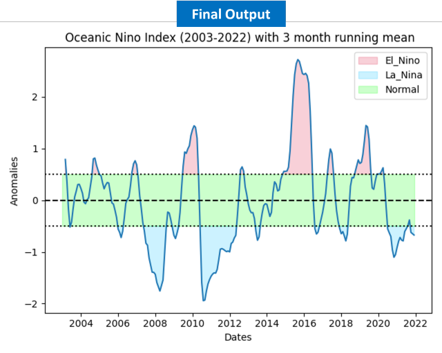

# Anomaly-Detection-with-EarthObservation
This repository is the result of an academic course assignment focused on detecting sea surface temperature anomalies using MODIS satellite data. The project includes the calculation of the ENSO index to identify El Niño and La Niña events.

## Outputs
###  El Niño and La Niña explanation

El Nino Southern Oscillation (ENSO) is the most important year-to-year climate signal on Earth. It is a part of the climate system that is marked by warm El Nino(McPhaden et al., 2006), unusually high sea surface temperatures in the tropical Pacific Ocean's central and eastern regions and by widespread shifts in the region's surface pressure and cold La Nia events (Glantz et al., 2018). Scientists from around the world were unable to determine the cause of ENSO events; however, they developed indexes to anticipate and monitor these occurrences (Hafez, 2016). For this Assignment, I have used Oceanic Nino Index (ONI) which is based on fluctuations in 3-month running means (3-MRMs) of sea surface temperatures (SSTs) in Nino 3.4 region, a region of the central Pacific (Glantz & Ramirez, 2020).

---

### Methodological Flowchart

---

### Step wise Flowchart

---

### Final Output

